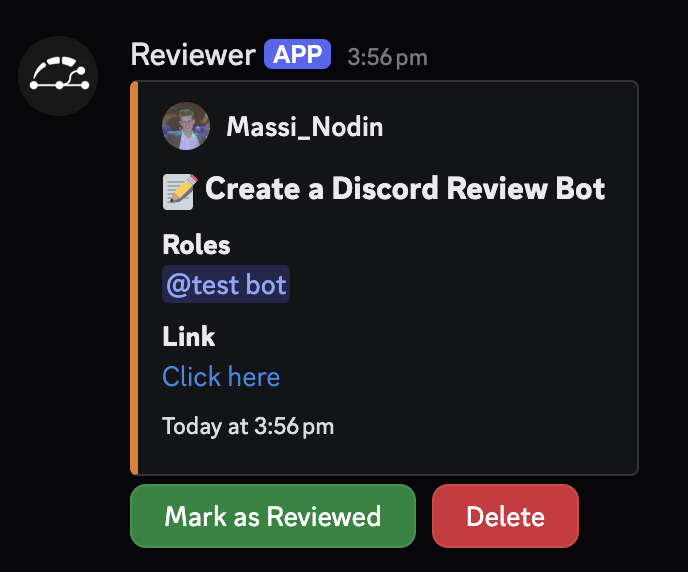
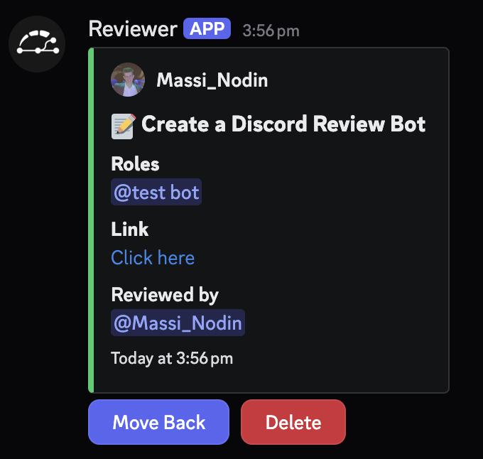

# 🤖 Reviewer Bot

A modern Discord bot for managing code and task reviews in your server!  
Reviewer Bot helps your community organize, track, and complete reviews with ease, using intuitive slash commands and interactive buttons.

---

## ✨ Features

- **Slash Commands** for all major actions
- **Active Reviews** and **Reviewed Tasks** channels, auto-managed
- **Role-based Review Assignment**: Assign reviews to specific roles
- **Interactive Buttons** for marking tasks as reviewed, moving them back, or deleting
- **DM Notifications** for review completions
- **Permission-aware**: Only authors or assigned roles can mark reviews as complete
- **Persistent Data**: All reviews are stored in a JSON file
- **Easy Setup**: One command to get started!

---

## 🚀 Getting Started

### 1. Clone the Repository

```bash
git clone https://github.com/MassimoNodin/reviewer-bot.git
cd reviewer-bot
```

### 2. Install Requirements

```bash
pip install -r requirements.txt
```

> **Note:** This bot requires Python 3.9+ and the latest version of `discord.py`.

### 3. Add Your Bot Token

- Create a file named `token.txt` in the project root.
- Paste your Discord bot token inside (no spaces or newlines).

`.gitignore` already excludes this file for your safety.

### 4. Run the Bot

```bash
python reviewer.py
```

The bot can also be automatically updated and restarted upon pushes to its GitHub repository using a webhook listener.

---

## ⚙️ Automatic Updates via GitHub Webhook (Optional Setup)

Instead of manual updates, you can configure the bot to automatically pull changes and restart when you push to its GitHub repository. This uses a Flask webhook listener managed by systemd and proxied by Nginx.

**Requirements:**
*   A server with a public IP address or domain name.
*   Nginx installed (`sudo apt update && sudo apt install nginx`).
*   Gunicorn installed (`pip install gunicorn`).
*   Git installed.
*   SSL certificate (Let's Encrypt recommended).
*   A systemd service file for the main bot (e.g., `reviewer.service`, assumed name).
*   **Passwordless sudo:** The user running the webhook listener service (`massimo-nodin` in the example) needs passwordless sudo permission *specifically* to restart the bot's systemd service.

**Steps:**

1.  **Configure Passwordless Sudo (CRITICAL):**
    *   Edit the sudoers file safely: `sudo visudo`
    *   Add the following line, replacing `massimo-nodin` with the correct username and `reviewer.service` with the actual service name:
        ```
        massimo-nodin ALL=(ALL) NOPASSWD: /usr/bin/systemctl restart reviewer.service
        ```
    *   **Warning:** Granting sudo permissions incorrectly can be a security risk. Ensure the path and command are exact.

2.  **Create `secrets.txt`:**
    *   In the project root, create a file named `secrets.txt`.
    *   Add a line with a strong, randomly generated secret for webhook verification:
        ```
        WEBHOOK_SECRET=your_very_strong_random_secret_here
        ```
    *   `.gitignore` already excludes this file.

3.  **Webhook Listener Script:**
    *   The `webhook_listener.py` script (included) listens for webhook POST requests from GitHub.
    *   It verifies the request signature using the `WEBHOOK_SECRET` from `secrets.txt`.
    *   On a valid push to the `main` branch, it executes `git pull` in the bot's directory and then runs `sudo systemctl restart reviewer.service` (using the passwordless sudo permission configured above) to restart the main bot service.

4.  **Systemd Service for Webhook Listener:**
    *   Copy the provided `update_and_restart_reviewer.service` file to `/etc/systemd/system/`. **Note:** Despite the filename, this service now runs the *webhook listener*, not the old update script. You might consider renaming the `.service` file for clarity (e.g., `reviewer-webhook.service`) and updating commands accordingly.
    *   Enable and start the service:
        ```bash
        # If using the original filename:
        sudo cp update_and_restart_reviewer.service /etc/systemd/system/
        sudo systemctl enable update_and_restart_reviewer.service
        sudo systemctl start update_and_restart_reviewer.service
        sudo systemctl status update_and_restart_reviewer.service # Check status
        ```
    *   This service runs the `webhook_listener.py` using Gunicorn.

5.  **Nginx Configuration:**
    *   Configure Nginx as a reverse proxy to securely forward requests from the internet to the local webhook listener (running on port 5000 by default).
    *   Create an Nginx site configuration file (e.g., `/etc/nginx/sites-available/reviewer-webhook`) similar to the example provided in the repository or documentation. **Crucially, configure SSL.**
    *   Enable the site and reload Nginx:
        ```bash
        sudo ln -s /etc/nginx/sites-available/reviewer-webhook /etc/nginx/sites-enabled/
        sudo nginx -t # Test configuration
        sudo systemctl reload nginx
        ```

6.  **GitHub Webhook Setup:**
    *   Go to your bot's repository on GitHub -> Settings -> Webhooks -> Add webhook.
    *   **Payload URL:** `https://your_domain_or_ip/webhook` (Use your public URL configured in Nginx).
    *   **Content type:** `application/json`.
    *   **Secret:** Paste the *same* secret you put in `secrets.txt`.
    *   **Which events?** Select "Just the push event".
    *   Ensure "Active" is checked.
    *   Add the webhook. GitHub will send a 'ping' event to test the connection. Check the listener's logs (`journalctl -u update_and_restart_reviewer.service -f`) or Nginx logs for confirmation.

Now, whenever you push changes to the `main` branch of your repository, GitHub will notify your server, triggering an automatic `git pull` and restart of the Reviewer Bot via its systemd service.

---

## 📁 Required Service Files

The following files are required for Reviewer Bot and the optional webhook automation to work:

- `token.txt`: Your Discord bot token (see above).
- `reviews.json`: Stores all review data. This file is created and managed by the bot.
- `secrets.txt`: Contains the `WEBHOOK_SECRET` for GitHub webhook verification.
- `webhook_listener.py`: Flask application that listens for GitHub webhooks, runs `git pull`, and triggers the bot restart.
- `update_and_restart_reviewer.service`: Systemd unit file to run the `webhook_listener.py` via Gunicorn (typically placed in `/etc/systemd/system/`). Consider renaming for clarity (e.g., `reviewer-webhook.service`).
- `reviewer.service`: (Not provided, but required) A separate systemd service to run the main `reviewer.py` bot itself. This is the service restarted by the webhook listener.

All sensitive files (`token.txt`, `secrets.txt`, `reviews.json`) are excluded from version control by `.gitignore`.

---

## 🖼️ Example Interactions

### 1. Submitting a Review

**Command:**  
`/review title: Create a Discord Review Bot roles: @testbot link: https://github.com/MassimoNodin/discord-reviewer`

**Result in `active-reviews` channel:**  


---

### 2. Marking as Reviewed

**Interaction:**  
A user clicks the **Mark as Reviewed** button on the review in the `active-reviews` channel marking it as reviewed and moving it to the `reviewed-tasks` channel.

**Result in `reviewed-tasks` channel:**  


---

### 3. DM Notification

**Interaction:**  
The author receives a DM notification when their task is marked as reviewed.

**DM Example:**  


---

## 🛠️ Usage

### Setup

- `/create`  
  *Admin only.* Creates the `active-reviews` and `reviewed-tasks` channels.

### Submitting a Review

- `/review title:"Task Title" role:@Role link:"URL"`  
  Submit a task for review.  
  - `role` and `link` are optional.
  - Or use the **Create Review** button in the `active-reviews` channel.

### Managing Reviews

- **Mark as Reviewed**  
  Only the author or assigned roles can mark a review as complete.

- **Move Back**  
  Move a reviewed task back to active reviews.

- **Delete**  
  Delete a review (only the author can delete their own).

### Help

- `/help`  
  Get a DM with a full guide to using the bot.

- `/delete`  
  *Admin only.* Delete the review channels after confirmation.

---

## 📁 Project Structure

```
reviewer.py
cogs/
  review_commands.py
  review_views.py
  review_modals.py
  review_utils.py
  review_events.py
reviews.json
token.txt
.gitignore
README.md
```

---

## 📝 Customization

- **Channel Names:**  
  Change `'active-reviews'` and `'reviewed-tasks'` in `review_commands.py` if you want custom names.

- **Permissions:**  
  The bot needs permission to manage channels, send messages, use slash commands, and manage messages.

---

## 🛡️ Security

- **Never share your `token.txt`!**
- The bot will not commit your token or review data thanks to `.gitignore`.

---

## 💡 Tips

- Pin the bot's help message in your channels for easy access.
- Use roles to organize who can review what.
- Only admins can create or delete review channels.

---

## 🤝 Contributing

Pull requests and suggestions are welcome!  
Open an issue or submit a PR to help improve Reviewer Bot.

---

## 📜 License

MIT License

---

## 👤 Author

Made with ❤️ by Massimo Nodin

---

Enjoy organized, efficient reviews with Reviewer Bot! 🚀
